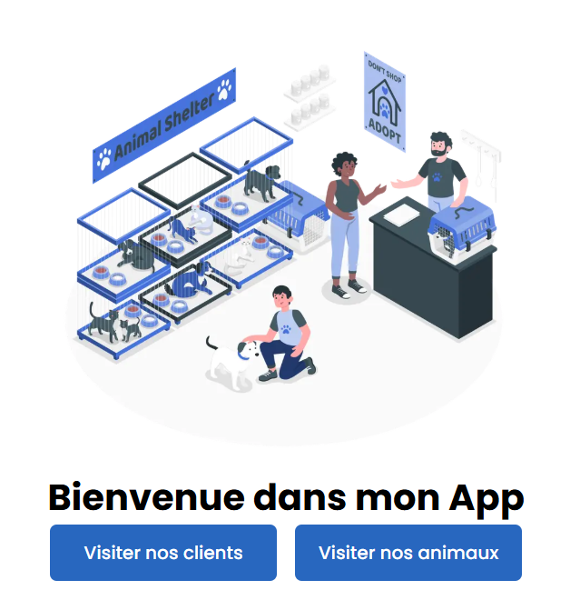

🐾 *TKorp - Test Technique (Partie Next.js)*

Ce projet est une application Next.js développée dans le cadre du test technique de TKorp. Il permet d'afficher des informations sur des animaux de compagnie et leurs propriétaires grâce aux donnée dans le fichier json.

🚀 *Fonctionnalités*

Affichage de la liste des personnes et de leurs animaux.
Ajout d'une nouvelle personne via un formulaire.
Affichage de statistiques :
    Animal le plus vieux
    Espèce la plus représentée
    Personne avec le plus d'animaux
    Personne avec le plus de chats
    Animal le plus lourd
    Personne avec le groupe d'animaux le plus lourd

🛠️ *Technologies utilisées*

    Next.js
    React
    TypeScript

⚙️ *Installation et lancement*

Assurez-vous d'avoir Node.js installé sur votre machine.

Clonez le dépôt :

git clone https://github.com/Dom-nlk/Test-Tkorp.git
cd tkorp-nextjs
Installez les dépendances :

npm install

Lancez le serveur de développement :

npm run dev

Ouvrez votre navigateur à l'adresse http://localhost:3000 pour voir l'application.

📸 *Aperçu*

